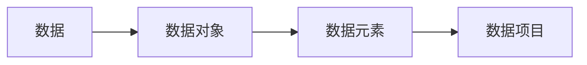
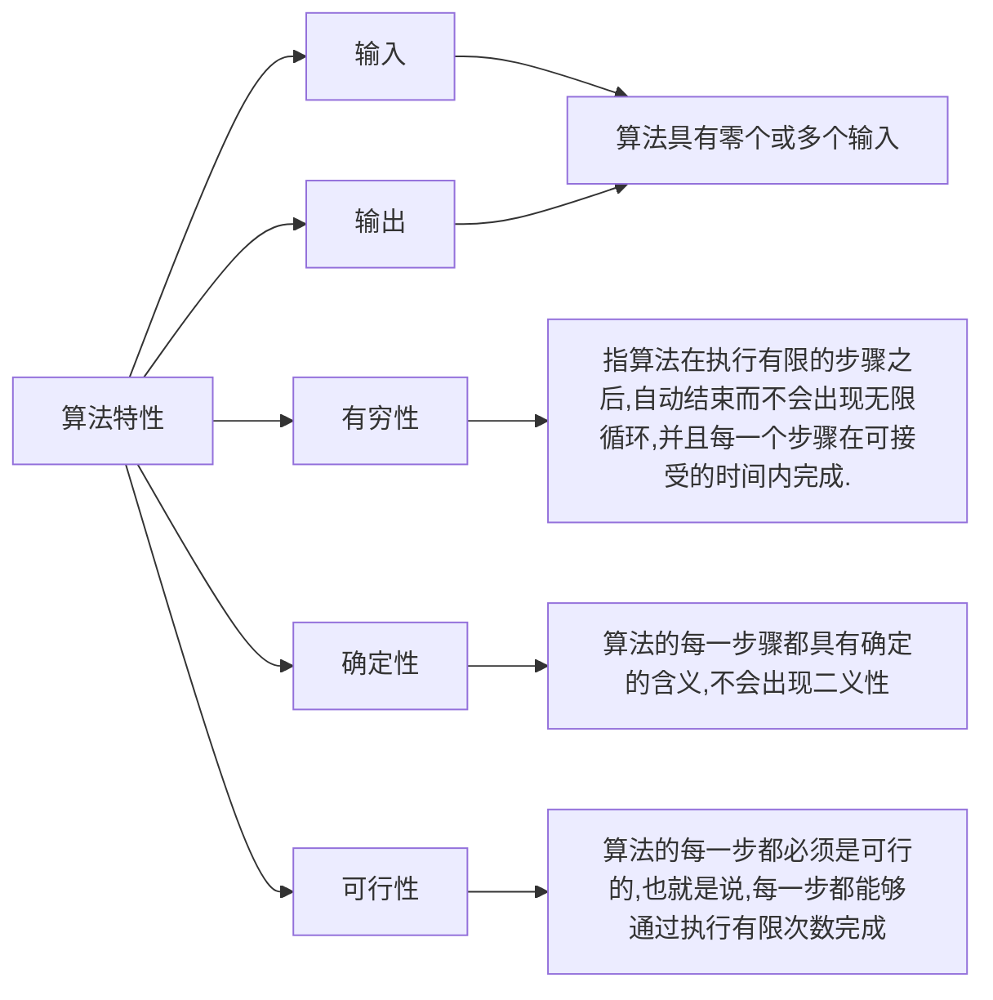
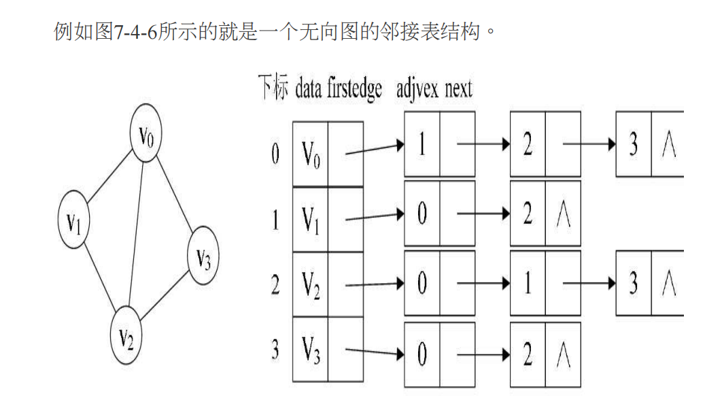
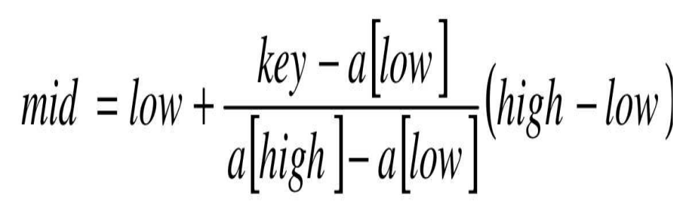
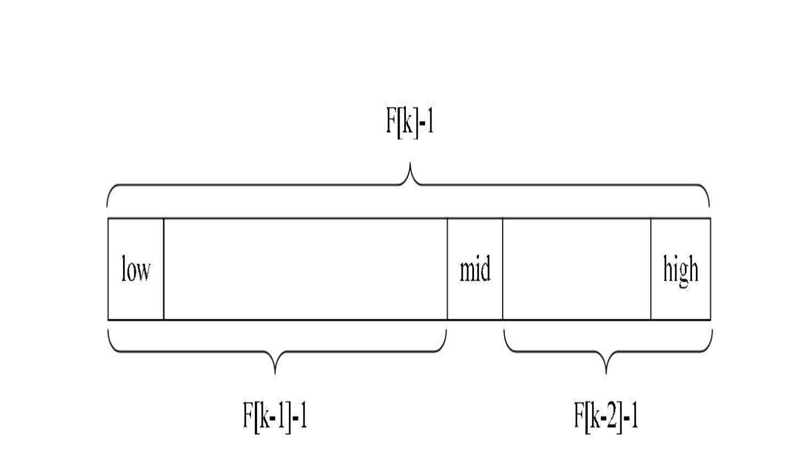
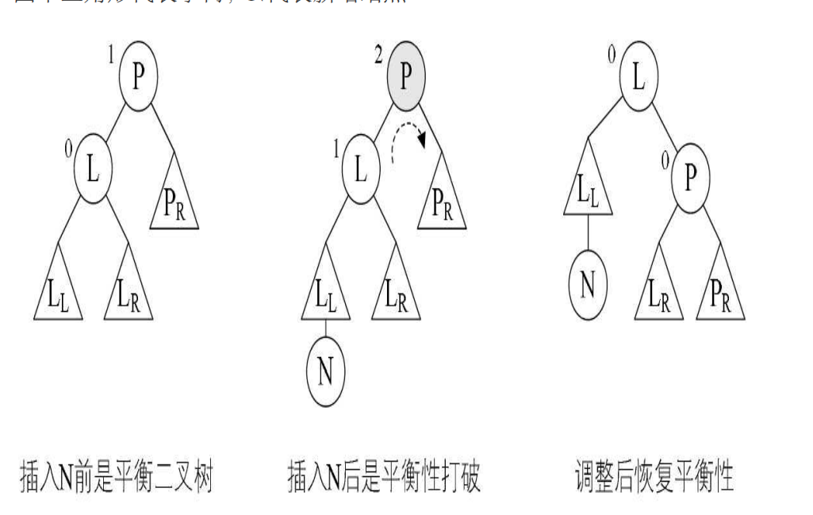
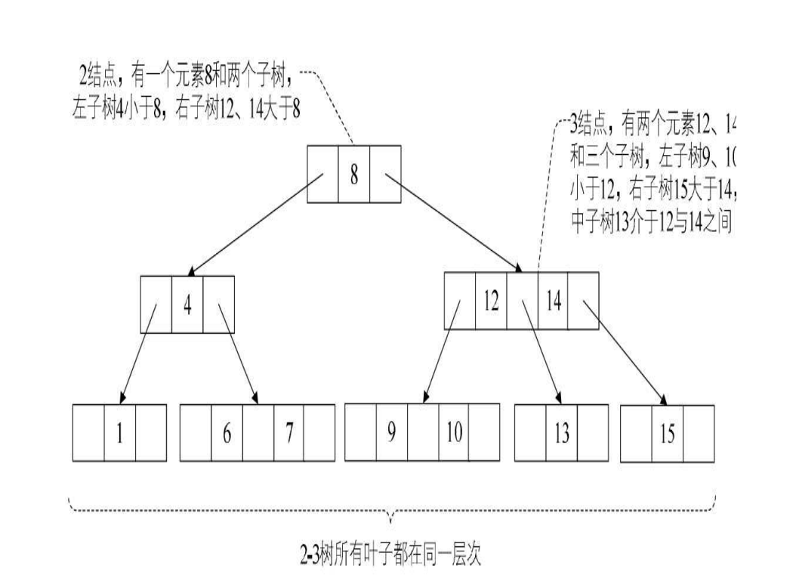
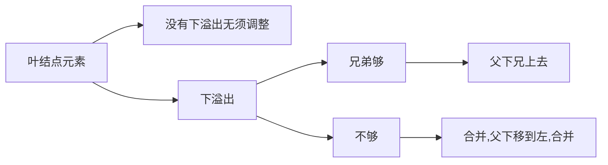
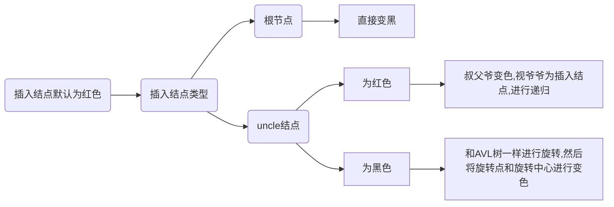
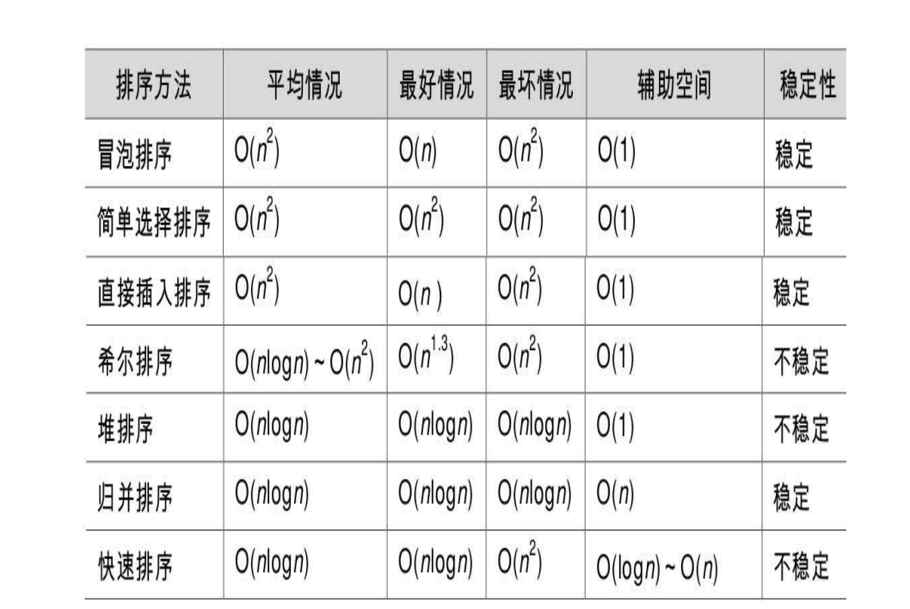

# 第一章

数据：计算机中可以操作的对象

数据元素：组成数据的基本单位

数据项：数据结构的组成要素

数据对象：性质相同的数据元素

逻辑结构:集合结构，线性结构，树状结构，图形结构

物理结构（存储）：顺序存储，链式存储





静态链表：用数组来代替指针，来描述单链表，让数组的元素都是由两个数据域组成，data和cur。也就是说，数组的每个下标都对应一个data和一个cur。数据域data，用来存放数据元素，也就是通常我们要处理的数据；而cur相当于单链表中的next指针，存放该元素的后继在数组中的下标，我们把cur叫做游标


#### **KMP**模式匹配算法

查找文本串中是否有模式串

前缀函数：一个字符串中第i个前缀最长匹配真前后缀的长度

将文本串与模式串（后者在前）相连，列出对应前缀表，如果表中有值与模式串的长度相同，则说明找到了

```c++
int str(string main,string pattern){
    int n = main.size(),m=pattern.size();
    string s = pattern + '#' + main;
    vector<int> pi(s.size());
    for(int i = 1;i < s.size;i++){
        int len = pi[i-1];
        while(len && s[i]!=s[len]){
      	  len = pi[len-1];
        }   
   		if(s[i]==s[len]){
            pi[i]=len+1;
            if(pi[i]==m){
                return i-m*2;
            }
        }
    }
    return -1;
}
```


>树可以用双亲表示法表示：data是数据域，存储结点的数据信息。而parent是指针域，存储该
>
>结点的双亲在数组中的下标。
>
>增加一个结点最左边孩子的域，不妨叫它长子域，这样就可以很容易得到结点的孩子。如果没有孩子的结点，这个长子域就设置为-1
>
>另外一个问题场景，我们很关注各兄弟之间的关系，双亲表示法无法体现这样的关系，那我们怎么办？嗯，可以增加一个右兄弟域来体现兄弟关系，也就是说，每一个结点如果它存在右兄弟，则记录下右兄弟的下标。同样的，如果右兄弟不存在，则赋值为-1，


>由于树中每个结点可能有多棵子树，可以考虑用多重链表，即每个结点有多个指针域，其中每个指针指向一棵子树的根结点，我们把这种方法叫做多重链表表示法
>
>一种是指针域的个数就等于树的度
>
>第二种方案每个结点指针域的个数等于该结点的度，我们专门取一个
>
>位置来存储结点指针域的个数


>孩子表示法:把每个结点的孩子结点排列起来，以单链表作存储结构，则n个结点有n个孩子链表，如果是叶子结点则此单链表为空。然后n个头指针又组成一个线性表，采用顺序存储结构，存放进一个一维数组中
>
>为此，设计两种结点结构，一个是孩子链表的孩子结点,child是数据域，用来存储某个结点在表头数组中的下标。next是指针域，用来存储指向某结点的下一个孩子结点的指针
>
>另一个是表头数组的表头结点,data是数据域，存储某结点的数据信息。firstchild是头指针域，存储该结点的孩子链表的头指针

```c++
/* 孩子结点 */
typedef struct CTNode
{
	int child;
    struct CTNode *next;
} *ChildPtr;
/* 表头结构 */
typedef struct
{
    TElemType data;
    ChildPtr firstchild;
} CTBox;
/* 树结构 */
typedef struct
{
    /* 结点数组 */
    CTBox nodes[MAX_TREE_SIZE];
    /* 根的位置和结点数 */
    int r,n;
} CTree;
```

结合：双亲孩子表示法

>孩子兄弟表示法：设置两个指针，分别指向该结点的第一个孩子和此结点的右兄弟，data是数据域，firstchild为指针域，存储该结点的第一个孩子结点的存储地址，right-sib是指针域，存储该结点的右兄弟结点的存储地址

#### 二叉树的特点:

每个结点最多有两棵子树

左子树和右子树是有顺序的，次序不能任意颠倒

即使树中某结点只有一棵子树，也要区分它是左子树还是右子树

#### 满二叉树

（1）叶子只能出现在最下一层。出现在其他层就不可能达成平衡。

（2）非叶子结点的度一定是2。

（3）在同样深度的二叉树中，满二叉树的结点个数最多，叶子数最多。


对一棵具有n个结点的二叉树按层序编号，如果编号为i（1≤i≤n）的结点与同样深度的满二叉树中编号为i的结点在二叉树中位置完全相同，则这棵二叉树称为完全二叉树

#### 完全二叉树的特点：

（1）叶子结点只能出现

在最下两层。

（2）最下层的叶子一定集中在左部连续位置。

（3）倒数二层，若有叶子结点，一定都在右部连续位置。

（4）如果结点度为1，则该结点只有左孩子，即不存在只有右子树的情况。

（5）同样结点数的二叉树，完全二叉树的深度最小

#### 二叉树的性质

性质1：在二叉树的第i层上至多有2^i-1^ 个结点（i≥1）

性质2：深度为k的二叉树至多有2^k^-1个结点（k≥1）

性质3：对任何一棵二叉树T，如果其终端结点数为n~0~ ，度为2的结点数为n~2~ ，则n~0~ =n~2~+1(终端结点数其实就是叶子结点数)

性质4：具有n个结点的完全二叉树的深度为|log~2~ n+1|（|x|表示不大于x的最大整数）

性质5：如果对一棵有n个结点的完全二叉树（其深度为）的结点按层序编号（从第1层到第层，每层从左到右），对任一结点i（1≤i≤n）有：

1．如果i=1，则结点i是二叉树的根，无双亲；如果i>1，则其双亲是结点。

2．如果2i>n，则结点i无左孩子（结点i为叶子结点）；否则其左孩子是结点2i。 

3．如果2i+1>n，则结点i无右孩子；否则其右孩子是结点2i+1。

> 一般而言，完全二叉树使用顺序存储
>
> 二叉链表：lchild data rchild，其中data是数据域，lchild和rchild都是指针域，分别存放指向左孩子和右孩子的指针
>
> 如果有需要，还可以再增加一个指向其双亲的指针域，那样就称之为三叉链表

#### 二叉树遍历方法

1．前序遍历：若二叉树为空，则空操作返回，否则先访问根结点，然后前序遍历左子树，再前序遍历右子树

2 . 中序遍历：若树为空，则空操作返回，否则从根结点开始（注意并不是先访问根结点），中序遍历根结点的左子树，然后是访问根结点，最后

中序遍历右子树

3 . 后序遍历：若树为空，则空操作返回，否则从左到右先叶子后结点的方式遍历访问左右子树，最后是访问根结点

4．层序遍历：若树为空，则空操作返回，否则从树的第一层，也就是根结点开始访问，从上而下逐层遍历，在同一层中，按从左到右的顺序对结

点逐个访问


> 如果我们要在内存中建立一个如图这样的树，为了能让每个结点确认是否有左右孩子，我们对它进行了扩展，也就是将二叉树中每个结点的空指针引出一个虚结点，其值为一特定值，比如“#”。我们称这种处理后的二叉树为原二叉树的扩展二叉树。扩展二叉树就可以做到一个遍历序列确定一棵二叉树了


指向前驱和后继的指针称为线索，加上线索的二叉链表称为线索链表，相应的二叉树就称为线索二叉树（Threaded Binary Tree）

```c
/* Link==0表示指向左右孩子指针 */
/* Thread==1表示指向前驱或后继的线索 */
typedef enum {Link, Thread} PointerTag;
/* 二叉线索存储结点结构 */
typedef struct BiThrNode
{
    /* 结点数据 */
    TElemType data;
    /* 左右孩子指针 */
    struct BiThrNode *lchild, *rchild;
    PointerTag LTag;
    /* 左右标志 */
    PointerTag RTag;
} BiThrNode, *BiThrTree;
```

#### 树转换为二叉树:

 1.加线。在所有兄弟结点之间加一条连线。

 2.去线。对树中每个结点，只保留它与第一个孩子结点的连线，删除它与其他孩子结点之间的连线。

 3.层次调整

#### 　森林转换为二叉树

森林是由若干棵树组成的，所以完全可以理解为，森林中的每一棵树都是兄弟，可以按照兄弟的处理办法来操作。步骤如下：

 1.把每个树转换为二叉树。 

2.第一棵二叉树不动，从第二棵二叉树开始，依次把后一棵二叉树的根结点作为前一棵二叉树的根结点的右孩子，用线连

接起来。当所有的二叉树连接起来后就得到了由森林转换来的二叉树

#### 二叉树转换为树

1.加线。若某结点的左孩子结点存在，则将这个左孩子的右孩子结点、右孩子的右孩子结点、右孩子的右孩子的右孩子结点……哈，反正就是左孩子的n个右孩子结点都作为此结点的孩子。将该结点与这些右孩子结点用线连接起来。

 2.去线。删除原二叉树中所有结点与其右孩子结点的连线。

 3.层次调整

#### 二叉树转换为森林

 1.从根结点开始，若右孩子存在，则把与右孩子结点的连线删除，再查看分离后的二叉树，若右孩子存在，则连线删除……，直到所有右孩子连线都删除为止，得到分离的二叉树。 

2.再将每棵分离后的二叉树转换为树即可


#### 图的表示方法

邻接矩阵

邻接表：

1.图中顶点用一个一维数组存储，当然，顶点也可以用单链表来存储，不过数组可以较容易地读取顶点信息，更加方便。另外，对于顶点数组中，每个数据元素还需要存储指向第一个邻接点的指针，以便于查找该顶点的边信息。

2.图中每个顶点v i 的所有邻接点构成一个线性表，由于邻接点的个数不定，所以用单链表存储，无向图称为顶点v i 的边表，有向图则称为顶点v i 作为弧尾的出边表



十字链表：

顶点表结点结构：data firstin firstout其中firstin表示入边表头指针，指向该顶点的入边表中第一个结点，firstout表示出边表头指针，指向该顶点的出边表中的第一个结点

边表结点结构：tailvex是指弧起点在顶点表的下标，headvex是指弧终点在顶点表中的下标，headlink是指入边表指针域，指向终点相同的下一条边，taillink是指边表指针域，指向起点相同的下一条边


邻接多重表：边表结点结构，ivex和jvex是与某条边依附的两个顶点在顶点表中的下标。ilink指向依附顶点ivex的下一条边，jlink指向依附顶点jvex的下一条边（树补边）


边集数组：由两个一维数组构成。一个是存储顶点的信息；另一个是存储边的信息，这个边数组每个数据元素由一条边的起点下标（begin）、终点下标（end）和权（weight）组成


#### 图的遍历：

深度优先遍历（DFS）：从一点开始向外寻找未访问过的点，通过访问表确定是否访问过，访问的点没有相邻未访问点进行回退，进行出栈，全访问过了就换一个图或者停止，

广度优先遍历（BFS）：从一点开始向外访问点，将访问的点存入队列，依次访问队列中相邻的定顶点，访问完就出列


#### 最小生成树（带权连通图）算法：

**Prim**算法：从一点开始，找相邻边权值最小的点，然后找与已找过的点相邻权值最小的点，适合使用邻接矩阵表示

**Kruskal**算法：从小到大加边，但是不形成圈，适合使用边集数组，判断圈则将边起点为下标，尾为下标值，判断边尾下标对应值是否相等即可


#### 最短路径算法

**Dijkstra**算法：初始距离表为无穷，从一点出发，借助邻接表更新权值，同时记录前面点，而后从更新后权值最小的点出发，将其标记为已找到最短路径，重复上述方法，直到全部找到最短路径，而后由记录的前面点进行回溯，实现了一个局部最优以到达全局最优的方法，但无法处理负权图

**Floyd**算法：带权图，通过两个表记录状态，分别是D表和P表，D表用于权值更新，P表用于记录路径，初始状态下将D表初始化为邻接矩阵，P表按两点之间是否有直接路径的原则进行初始化，若有，则记录前驱点，若无，则记为-1，表示未找到。P表也有另外一种初始化方法，即将其初始化为后驱点自己。第二种更加通用。而后进行更新，按尝试将每一个点作为中转点的方式计算权值，反复更新

> tip：中转点为当前前驱点或者后驱点时应跳过，同时对角线直接跳过


#### 拓扑排序

针对有向无回路图，也可以称为AOV网络，适合使用邻接表表示，同时记录最开始的入度，寻找入度为0的点，放入栈，删去该点，出栈进入队列，更新入度表，重复上述流程


#### 关键路径

AOE网，带权AOV网络，通过拓扑排序，依次寻找顶点的最早发生时间，发现变长就更新，最后到达终点，终点的最早发生与最晚发生时间相同，然后从顶点出发进行逆拓扑排序（出度为0），找到各个顶点的最晚开始时间，越短越更新。然后进行边的最早开始时间更新，边的最早开始时间即为起点的最早开始时间。然后进行边的最晚开始时间更新，边的最晚开始时间为终点的最晚开始时间减去边值。最后得到的边最早开始时间和边最晚开始相同的为关键边，即为关键事件。

> 最晚开始时间表示超过这个时间，总体进度必定被延长。最早开始时间表示再想干活也得到这个时间才能开始。


查找表（Search Table）是由同一类型的数据元素（或记录）构成的集合

关键字（Key）是数据元素中某个数据项的值，又称为键值，用它可以标识一个数据元素。也可标识一个记录的某个数据项（字段），我们称为关键码

此关键字可以唯一地标识一个记录，则称此关键字为主关键字（Primary Key）

对于那些可以识别多个数据元素（或记录）的关键字，我们称为次关键字（SecondaryKey）

#### 静态查找表（Static Search Table）：

只作查找操作的查找表。它的主要操作有：

（1）查询某个“特定的”数据元素是否在查找表中。

（2）检索某个“特定的”数据元素和各种属性

#### 动态查找表（Dynamic Search Table）：

在查找过程中同时插入查找表中不存在的数据元素，或者从查找表中删除已经存在的某个数据元素。显然动态查找表的操作就是两个：

（1）查找时插入数据元素。

（2）查找时删除数据元素。


面向查找操作的数据结构称为查找结构


顺序查找（Sequential Search）又叫线性查找，是最基本的查找技术，它的查找过程是：从表中第一个（或最后一个）记录开始，逐个进行记录的关键字和给定值比较


#### 有序表查找

折半查找

插值查找:根据要查找的关键字key与查找表中最大最小记录的关键字比较后的查找方法，其核心就在于插值的计算公式(key-a[low])/(a[high]-a[low])



　斐波那契查找:

```c++
/* 斐波那契查找 */
int Fibonacci_Search(int *a, int n, int key)
{
    int low, high, mid, i, k;
    /*定义最低下标为记录首位 */
    low = 1;
    /*定义最高下标为记录末位 */
    high = n;
    k = 0;
    /* 计算n位于斐波那契数列的位置 */
    while (n > F[k] - 1)
        k++;
    /* 将不满的数值补全 */
    for (i = n; i < F[k] - 1; i++)
        a[i] = a[n];
    while (low <= high)
    {
        /* 计算当前分隔的下标 */
        mid = low + F[k - 1] - 1;
        /* 若查找记录小于当前分隔记录 */
        if (key < a[mid])
        {
            /* 最高下标调整到分隔下标mid-1处 */
            high = mid - 1;
            /* 斐波那契数列下标减一位 */
            k = k - 1;
        }
        /* 若查找记录大于当前分隔记录 */
        else if (key > a[mid])
        {
            /* 最低下标调整到分隔下标mid+1处 */
            low = mid + 1;
            /* 斐波那契数列下标减两位 */
            k = k - 2;
        }
        else
        {
            if (mid <= n)
                /* 若相等则说明mid即为查找到的位置 */
                return mid;
            else
                /* 若mid>n说明是补全数值，返回n */
                return n;
        }
    }
    return 0;
}
```

原理：利用斐波那契数列进行分割，根据其当前项等于前两项之和的特点进行分割

斐波那契查找算法的核心在于：

（1）当key=a[mid]时，查找就成功；

（2）当key<a[mid]时，新范围是第low个到第mid-1个，此时范围个数为F[k-1]-1个；

（3）当key>a[mid]时，新范围是第m+1个到第high个，此时范围个数为F[k-2]-1个



#### 线性索引查找

索引就是把一个关键字与它对应的记录相关联的过程，一个索引由若干个索引项构成，每个索引项至少应包含关键字和其对应的记录在存储器中的位置等信息

###### 稠密索引

稠密索引是指在线性索引中，将数据集中的每个记录对应一个索引项

对于稠密索引这个索引表来说，索引项一定是按照关键码有序的排列

###### 分块索引

稠密索引因为索引项与数据集的记录个数相同，所以空间代价很大。为了减少索引项的个数，我们可以对数据集进行分块，使其分块有序，然后再对每一块建立一个索引项

分块索引一般要求块内无序，块间有序

分块索引的索引项结构分三个数据项：

最大关键码，它存储每一块中的最大关键字，

存储了块中的记录个数；

用于指向块首数据元素的指针

###### 倒排索引

索引项的通用结构是：

次关键码，记录号表

其中记录号表存储具有相同次关键字的所有记录的记录号（可以是指向记录的指针或者是该记录的主关键字）。这样的索引方法就是倒排索引（in-verted index）。倒排索引源于实际应用中需要根据属性（或字段、次关键码）的值来查找记录

#### 平衡二叉树

高度平衡的二叉排序树。我们将二叉树上结点的左子树深度减去右子树深度的值称为平衡因子BF（Balance Factor），那么平衡二叉树上所有结点的平衡因子只可能是-1、0和1

距离插入结点最近的，且平衡因子的绝对值大于1的结点为根的子树，我们称为最小不平衡子树

平衡二叉树构建的基本思想就是在构建二叉排序树的过程中，每当插入一个结点时，先检查是否因插入而破坏了树的平衡性，若是，则找出最小不平衡子树。在保持二叉排序树特性的前提下，调整最小不平衡子树中各结点之间的链接关系，进行相应的旋转，使之成为新的平衡子树

```c++
/* 二叉树的二叉链表结点结构定义 */
/* 结点结构 */
typedef struct BiTNode
{
    /* 结点数据 */
    int data;
    /* 结点的平衡因子 */
    int bf;
    /* 左右孩子指针 */
    struct BiTNode *lchild, *rchild;
} BiTNode, *BiTree;
/* 对以p为根的二叉排序树作右旋处理， */
/* 处理之后p指向新的树根结点，即旋转处理之前
的左子树的根结点 */
void R_Rotate(BiTree *P)
{
    BiTree L;
    /* L指向P的左子树根结点 */
    L = (*P)->lchild;
    /* L的右子树挂接为P的左子树 */
    (*P)->lchild = L->rchild;
    L->rchild = (*P);
    /* P指向新的根结点 */
    *P = L;
}
/* 对以P为根的二叉排序树作左旋处理， */
/* 处理之后P指向新的树根结点，即旋转处理之前
的右子树的根结点0 */
void L_Rotate(BiTree *P)
{
    BiTree R;
    /* R指向P的右子树根结点 */
    R = (*P)->rchild;
    /* R的左子树挂接为P的右子树 */
    (*P)->rchild = R->lchild;
    R->lchild = (*P);
    /* P指向新的根结点 */
    *P = R;
}
#define LH +1 /* 左高 */
#define EH 0 /* 等高 */
#define RH -1 /* 右高 */
/* 对以指针T所指结点为根的二叉树作左平衡旋转
处理 */
/* 本算法结束时，指针T指向新的根结点 */
void LeftBalance(BiTree *T)
{
    BiTree L,Lr;
    /* L指向T的左子树根结点 */
    L = (*T)->lchild;
    switch (L->bf)
    {
            /* 检查T的左子树的平衡度，并作相应平衡处理 */
            /* 新结点插入在T的左孩子的左子树上，要作单右旋处理 */
        case LH:
            (*T)->bf = L->bf = EH;
            R_Rotate(T);
            break;
            /* 新结点插入在T的左孩子的右子树上，要作双旋处理 */
        case RH:
            /* Lr指向T的左孩子的右子树根 */
            Lr = L->rchild;
            /* 修改T及其左孩子的平衡因子 */
            switch (Lr->bf)
            {
                case LH: (*T)->bf = RH;
                    L->bf = EH;
                    break;
                case EH: (*T)->bf = L->bf = EH;
                    break;
                case RH: (*T)->bf = EH;
                    L->bf = LH;
                    break;
            }
            Lr->bf = EH;
            /* 对T的左子树作左旋平衡处理 */
            L_Rotate(&(*T)->lchild);
            /* 对T作右旋平衡处理 */
            R_Rotate(T);
    }
}
/* 若在平衡的二叉排序树T中不存在和e有相同关键
字的结点，则插入一个 */
/* 数据元素为e的新结点并返回1，否则返回0。若
因插入而使二叉排序树 */
/* 失去平衡，则作平衡旋转处理，布尔变量taller
反映T长高与否。 */
Status InsertAVL(BiTree *T, int e, Status *taller)
{
    if (!*T)
    {
        /* 插入新结点，树“长高”，置taller为TRUE */
        *T = (BiTree)malloc(sizeof(BiTNode));
        (*T)->data = e;
        (*T)->lchild = (*T)->rchild = NULL;
        (*T)->bf = EH;
        *taller = TRUE;
    }
    else
    {
        if (e == (*T)->data)
        {
            /* 树中已存在和e有相同关键字的结点则不再插入 */
            *taller = FALSE;
            return FALSE;
        }
        if (e < (*T)->data)
        {
            /* 应继续在T的左子树中进行搜索 */
            /* 未插入 */
            if (!InsertAVL(&(*T)->lchild, e, taller))
                return FALSE;
            /* 已插入到T的左子树中且左子树“长高” */
            if (*taller)
            {
                /* 检查T的平衡度 */
                switch ((*T)->bf)
                {
                        /* 原本左子树比右子树高，需要作左平衡处理 */
                    case LH:
                        LeftBalance(T);
                        *taller = FALSE;
                        break;
                        /* 原本左右子树等高，现因左子树增高而树增高 */
                    case EH:
                        (*T)->bf = LH;
                        *taller = TRUE;
                        break;
                        /* 原本右子树比左子树高，现左右子树等高 */
                    case RH:
                        (*T)->bf = EH;
                        *taller = FALSE;
                        break;
                } } }
        else
        {
            /* 应继续在T的右子树中进行搜索 */
            /* 未插入 */
            if (!InsertAVL(&(*T)->rchild, e, taller))
                return FALSE;
            /* 已插入到T的右子树且右子树“长高” */
            if (*taller)
            {
                /* 检查T的平衡度 */
                switch ((*T)->bf)
                {
                        /* 原本左子树比右子树高，现左、右子树等高 */
                    case LH:
                        (*T)->bf = EH;
                        *taller = FALSE;
                        break;
                        /* 原本左右子树等高，现因右子树增高而树增高 */
                    case EH:
                        (*T)->bf = RH;
                        *taller = TRUE;
                        break;
                        /* 原本右子树比左子树高，需要作右平衡处理 */
                    case RH:
                        RightBalance(T);
                        *taller = FALSE;
                        break;
                } } } }
    return TRUE;
}
```



如果是删除操作需要依次向上调整

#### 多路查找树（B树）

多路查找树（muitl-way search tree），其每一个结点的孩子数可以多于两个，且每一个结点处可以存储多个元素。由于它是查找树，所有元素之间存在某种特定的排序关系

2-3树：每一个结点都具有两个孩子（我们称它为2结点）或三个孩子（我们称它为3结点）

一个2结点包含一个元素和两个孩子（或没有孩子），且与二叉排序树类似，左子树包含的元素小于该元素，右子树包含的元素大于该元素。不过，与二叉排序树不同的是，这个2结点要么没有孩子，要有就有两个，不能只有一个孩子

一个3结点包含一小一大两个元素和三个孩子（或没有孩子），一个3结点要么没有孩子，要么具有3个孩子。如果某个3结点有孩子的话，左子树包含小于较小元素的元素，右子树包含大于较大元素的元素，中间子树包含介于两元素之间的元素

并且2-3树中所有的叶子都在同一层次上



> m阶B树：结点最多有m个分支，m-1个元素，最少有$\lceil m/2 \rceil$个分支，$\lceil m/2 \rceil$个元素（根节点特例，最少有两个分支，一个元素）
>
> m阶B树的插入先查找插入的位置进行插入，如果上溢出则中间元素$\lceil m/2 \rceil$上移，两边分裂，递归进行这个操作。

> 删除非叶结点元素最终会转化为删除叶结点元素



#### 红黑树

根和叶子（NULL）均为黑色，红色结点的孩子均为黑色

不存在连续的两个红色结点，任一结点到叶所有路径黑色点的数量相同

任一结点左右子树的高度不超过两倍



散列技术是在记录的存储位置和它的关键字之间建立一个确定的对应关系f，使得每个关键字key对应一个存储位置f（key）

#### 散列函数的构造方法

直接定址法：取关键字的某个线性函数值为散列地址

数字分析法：使用关键字的一部分来计算散列存储位置的方法

平方取中法：假设关键字是1234，那么它的平方就是1522756，再抽取中间的3位就是227，用做散列地址

折叠法：是将关键字从左到右分割成位数相等的几部分（注意最后一部分位数不够时可以短些），然后将这几部分叠加求和，并按散列表表长，取后几位作为散列地址

除留余数法：对于散列表长为m的散列函数公式为：f(key)=key mod p(p≤m)

随机数法：选择一个随机数，取关键字的随机函数值为它的散列地址

#### 处理散列冲突的方法

开放定址法：一旦发生了冲突，就去寻找下一个空的散列地址，只要散列表足够大，空的散列地址总能找到，并将记录存入f i (key)=(f(key)+d i )MOD m(d i =1,2,3,......,m-1)

本来都不是同义词却需要争夺一个地址的现象为堆积

二次探测法：增加平方运算不让关键字都聚集在某一块区域

f i (key)=(f(key)+d i )MOD m(d i =1 2 ,-1 2 ,2 2 ,-2 2 ,...,q 2 ,-q 2 ,q≤m/2)

随机探测法：在冲突时，对于位移量d i 采用随机函数计算得到，

再散列函数法：事先准备多个散列函数，相信总会有一个可以把冲突解决掉

链地址法：将所有关键字为同义词的记录存储在一个单链表中

公共溢出区法：为所有冲突的关键字建立了一个公共的溢出区来存放

在查找时，对给定值通过散列函数计算出散列地址后，先与基本表的相应位置进行比对，如果相等，则查找成功；如果不相等，则到溢出表去进行顺序查找

#### 散列表查找实现

首先是需要定义一个散列表的结构以及一些相关的常数。其中HashTable就是散列表结构。结构当中的elem为一个动态数组

```c++
#define SUCCESS 1
#define UNSUCCESS 0
/* 定义散列表长为数组的长度 */
#define HASHSIZE 12
#define NULLKEY -32768
typedef struct
{
    /* 数据元素存储基址，动态分配数组 */
    int *elem;
    /* 当前数据元素个数 */
    int count;
} HashTable;
/* 散列表表长，全局变量 */
int m = 0;
```

散列表的装填因子:所谓的装填因子α=填入表中的记录个数/散列表长度。α标志着散列表的装满的程度。当填入表中的记录越多，α就越大，产生冲突的可能性就越大

### 排序

冒泡排序：略

选择排序：略

直接插入排序：从索引1开始，将索引对应元素抽出，对其左侧进行平移操作（左侧为有序区）

希尔排序：缩小增量排序，借助增量序列表（要求递减，最后一位为1，常见为n/2，n/4……1，n表示数据量，向下取整），根据序列表，每隔一段取一个数，对这些数进行直接插入排序

#### 堆排序 O(nlogn)

堆是具有下列性质的完全二叉树：每个结点的值都大于或等于其左右孩子结点的值，称为大顶堆；或者每个结点的值都小于或等于其左右孩子结点的值，称为小顶堆

将待排序的序列构造成一个大顶堆。此时，整个序列的最大值就是堆顶的根结点。将它移走（其实就是将其与堆数

组的末尾元素交换，此时末尾元素就是最大值），然后将剩余的n-1个序列重新构造成一个堆，这样就会得到n个元素中的次大值。如此反复执行，便能得到一个有序序列了。

具体实现：

1.建堆：从第一个非叶结点开始(叶结点天然是堆)，将其子树依次调整成为堆

2.排序：每轮将堆顶换到最后一个结点，然后忽略这个结点，进行新一轮的调整，重复这个过程

> 堆一般使用数组表示，数据从下标1开始存有个好处，就是任一结点索引左右孩子和父亲的规律会更简单，也就是i号结点左孩子的下标是2*i，右孩子下标是2*i+1，父亲的下标是i/2下取整，方便后期搜索

#### 归并排序

归并：将两个有序的序列合并成一个序列的过程，每次去两个有序序列的第一位进行比较塞入合并后的数组

归并排序：

1.递归型：将整个数组依次折半到仅剩一个元素，对同一层次的进行归并操作，递归进行，直到完成

2.非递归型：一开始把每个元素看出一个有序组，相邻两两归并，重复这个过程

#### 快速排序

见另外一份笔记



排序算法的稳定性是指在排序过程中，相等元素的相对顺序是否保持不变